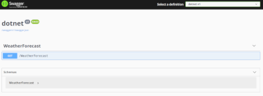

# Documento para Desarrolladores


------

## Tabla de contenido

- [Documento para Desarrolladores](#documento-para-desarrolladores)
  - [Tabla de contenido](#tabla-de-contenido)
  - [Quick Guide](#quick-guide)
  - [Creando un proyecto de webApi](#creando-un-proyecto-de-webapi)
  - [Testeando la aplicación](#testeando-la-aplicación)

------


## Quick Guide

Se provee a continuación una breve guía para la creación de una aplicación usando el **SDK .Net Core 5.0**.

Se supone que ya ha descargado la imagen de docker o a compilado la imagen a partir del archivo dockerfile. El siguiente paso es crear un contenedor con el cual poder trabajar.

La opción mas sencilla para ver como funciona es utilizar la siguiente linea para crear un contenedor que muestra las opciones de dotnet, y luego de eso se elimina automáticamente.

```bash
$ docker run -it --rm dotnet:latest "dotnet -h"
```


*Podemos ver la salida del comando anterior y ver las opciones que nos brinda el **SDK** de **.NET**:*

```markdown
SDK commands:
  add               Add a package or reference to a .NET project.
  build             Build a .NET project.
  build-server      Interact with servers started by a build.
  clean             Clean build outputs of a .NET project.
  help              Show command line help.
  list              List project references of a .NET project.
  msbuild           Run Microsoft Build Engine (MSBuild) commands.
  new               Create a new .NET project or file.
  nuget             Provides additional NuGet commands.
  pack              Create a NuGet package.
  publish           Publish a .NET project for deployment.
  remove            Remove a package or reference from a .NET project.
  restore           Restore dependencies specified in a .NET project.
  run               Build and run a .NET project output.
  sln               Modify Visual Studio solution files.
  store             Store the specified assemblies in the runtime package store.
  test              Run unit tests using the test runner specified in a .NET project.
  tool              Install or manage tools that extend the .NET experience.
  vstest            Run Microsoft Test Engine (VSTest) commands.
```


Para ver el listado de proyectos que puede crear utilizar la opción `new -l`:

```bash
$ docker run -it --rm dotnet:latest "dotnet new -l"
```


*La salida es el listado de templates que provee el core para la creación de proyectos:*

```
Console Application                           console         [C#],F#,VB  Common/Console        
Class library                                 classlib        [C#],F#,VB  Common/Library        
Worker Service                                worker          [C#],F#     Common/Worker/Web     
MSTest Test Project                           mstest          [C#],F#,VB  Test/MSTest           
NUnit 3 Test Item                             nunit-test      [C#],F#,VB  Test/NUnit            
NUnit 3 Test Project                          nunit           [C#],F#,VB  Test/NUnit            
xUnit Test Project                            xunit           [C#],F#,VB  Test/xUnit            
Razor Component                               razorcomponent  [C#]        Web/ASP.NET           
Razor Page                                    page            [C#]        Web/ASP.NET           
MVC ViewImports                               viewimports     [C#]        Web/ASP.NET           
MVC ViewStart                                 viewstart       [C#]        Web/ASP.NET           
Blazor Server App                             blazorserver    [C#]        Web/Blazor            
Blazor WebAssembly App                        blazorwasm      [C#]        Web/Blazor/WebAssembly
ASP.NET Core Empty                            web             [C#],F#     Web/Empty             
ASP.NET Core Web App (Model-View-Controller)  mvc             [C#],F#     Web/MVC               
ASP.NET Core Web App                          webapp          [C#]        Web/MVC/Razor Pages   
ASP.NET Core with Angular                     angular         [C#]        Web/MVC/SPA           
ASP.NET Core with React.js                    react           [C#]        Web/MVC/SPA           
ASP.NET Core with React.js and Redux          reactredux      [C#]        Web/MVC/SPA           
Razor Class Library                           razorclasslib   [C#]        Web/Razor/Library     
ASP.NET Core Web API                          webapi          [C#],F#     Web/WebAPI            
ASP.NET Core gRPC Service                     grpc            [C#]        Web/gRPC              
dotnet gitignore file                         gitignore                   Config                
global.json file                              globaljson                  Config                
NuGet Config                                  nugetconfig                 Config                
Dotnet local tool manifest file               tool-manifest               Config                
Web Config                                    webconfig                   Config                
Solution File                                 sln                         Solution              
Protocol Buffer File                          proto                       Web/gRPC     
```

------


## Creando un proyecto de webApi

Para la creación de un proyecto de webApi en **.NET Core** la opción mas sencilla es a partir de los templates vistos anteriormente.

El siguiente comando provee un proyecto de webApi:

```bash
$ docker run --rm -it -v /home/WebApiNET:/home/dotnet --name dotnet-cont dotnet "dotnet new webapi"
```

> Es importante aclarar, que el comando anterior  solamente crea el contenedor y ejecuta en su interior el comando dotnet new webapi. 
>
> Se crea el proyecto de la webApi y el contenedor se elimina automáticamente. 
>
> Esto se debe a la opción --rm utilizada en el comando docker run.


Dentro de la carpeta `/home/WebApiNET` se pueden observar los archivos del proyecto

```
├── bin
├── Controllers
├── obj
├── Properties
|   ├── launchSettings.json
├── appsettings.Development.json
├── appsettings.json
├── dotnet.cproj
├── Program.cs
├── Startup.cs
└── WeatherForecast.cs

```

------


## Testeando la aplicación

Para testear la aplicación es muy importante modificar el archivo `launchSettings.json` ya que este provee una configuración sobre la url y el puerto donde se podrá visualizar la aplicación. Es importante para poder interactuar con el contenedor que el host corresponda a la ip [0.0.0.0]().

La linea que hay que editar es la que corresponde a `applicationUrl` quedando de la siguiente manera:

```json
"applicationUrl": "https://0.0.0.0:5001;http://0.0.0.0:5000",
```


Una vez configurada la ip por defecto y los puertos definidos donde escuchará el servidor de aplicación. Es posible ejecutar un servidor utilizando la misma imagen de **docker dotnet**

Para ello vamos a pasar ahora el comando dotnet run y vamos a definir el correspondiente mapeo de los puertos con el sistema anfitrión.

```bash
$ docker run --rm -it -v /home/WebApiNET:/home/dotnet --name dotnet-cont -p 5000:5000 -p 5001:5001 dotnet "dotnet run"
```


Ahora es posible ver la aplicación abriendo un navegador web y pegando la siguiente url: [https://localhost:5001/swagger/index.html](https://localhost:5001/swagger/index.html)


Debería ver algo como esto:


