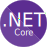

               
# docker image for dotNet
Imagen de docker para el desarrollo de aplicaciones en .Net

   

## Contributors

[](https://www.linkedin.com/in/hector-orlando-25124a18a/)

## Versión 2.0.0

Documento léeme

------

Copyright (C) 2021.

- Héctor Orlando, hcrispens
  hector.or.cr@gmail.com
  
  

------


## Descripción

**Docker** es un proyecto de [código abierto](https://es.wikipedia.org/wiki/Código_abierto) que automatiza el despliegue de [aplicaciones](https://es.wikipedia.org/wiki/Aplicación_informática) dentro de [contenedores de software](https://es.wikipedia.org/wiki/Contenedores_de_software), proporcionando una capa adicional de abstracción y automatización de  virtualización de aplicaciones en múltiples sistemas operativos.

Para el desarrollo de aplicaciones utilizando contenedores, se debe generar una imagen la cual se hace a traves de un documento **Dockerfile**

Esta imagen esta construida con la base de **Debian 11 Bullseye** e incorpora el **SDK** de **.NET Core 6.0** para el desarrollo de aplicaciones en .Net. Es decir que la imagen cuenta con todo lo necesario para trabajar con **.Net Core**. La imagen contiene el **SDK** de **.Net Core 6.0**, el cual puede ser usado para crear distintas aplicaciónes y herramientas a través del comando `dotnet new`, la forma de interactuar con el contenedor de esta imagen es a través del comando `dotnet`.

En cuanto a la forma de trabajo con esta imagen, es importante tener presente que el `ENTRYPOINT` de la misma es `/bin/sh`. Esto quiere decir que cuando se cargue un contenedor estará esperando comandos de bash.

------

## Cambios en la versión actual

- En la versión actual se actualizaron tanto el sistema operativo como también el **SDK** de **.NET Core**. 
- El sistema operativo base de la Imagen fué actualizado a **Debian 11 Bullseye**.
- El **SDK** de **.NET Core** se actualizó a la versión **6.0**.
- Se incorporó un mecanismo para trabajar con herramientas a través de `dotnet tool`.

------


## Compilar esta imagen

El proyecto cuenta con un documento Dockerfile denominado `dotnet.Dockerfile` el cual toma la base de debian 11 e instala el .Net Core 6.0.

Clone primero el proyecto utilizando git:

```bash
$ git clone https://github.com/hectorcrispens/dotNet.git

$ cd dotNet/
```

Para compilar la imagen utilice el siguiente comando:

```bash
$ docker build -t dotnet -f dotnet.Dockerfile .
```

De esta manera resulta sencillo compilar la imagen.

------


## Descargar la imagen de docker hub

También puede descargar la image ya construida desde [docker hub](https://hub.docker.com/)

```bash
$ docker pull hectorcrispens/dotnet:latest
```

------


## Construyendo un contenedor

La opción mas sencilla para ver como funciona es utilizar la siguiente linea para crear un contenedor que muestra las opciones de dotnet, y luego de eso se elimina automáticamente.

```bash
$ docker run -it --rm dotnet:latest "dotnet -h"
```

La salida del comando será algo como lo que ve a continuación:

```sh
.NET SDK (6.0.101)
Usage: dotnet [runtime-options] [path-to-application] [arguments]

Execute a .NET application.

runtime-options:
  --additionalprobingpath <path>   Path containing probing policy and assemblies to probe for.
  --additional-deps <path>         Path to additional deps.json file.
  --depsfile                       Path to <application>.deps.json file.
  --fx-version <version>           Version of the installed Shared Framework to use to run the application.
  --roll-forward <setting>         Roll forward to framework version  (LatestPatch, Minor, LatestMinor, Major, LatestMajor, Disable).
  --runtimeconfig                  Path to <application>.runtimeconfig.json file.

path-to-application:
  The path to an application .dll file to execute.

Usage: dotnet [sdk-options] [command] [command-options] [arguments]

Execute a .NET SDK command.

sdk-options:
  -d|--diagnostics  Enable diagnostic output.
  -h|--help         Show command line help.
  --info            Display .NET information.
  --list-runtimes   Display the installed runtimes.
  --list-sdks       Display the installed SDKs.
  --version         Display .NET SDK version in use.

SDK commands:
  add               Add a package or reference to a .NET project.
  build             Build a .NET project.
  build-server      Interact with servers started by a build.
  clean             Clean build outputs of a .NET project.
  format            Apply style preferences to a project or solution.
  help              Show command line help.
  list              List project references of a .NET project.
  msbuild           Run Microsoft Build Engine (MSBuild) commands.
  new               Create a new .NET project or file.
  nuget             Provides additional NuGet commands.
  pack              Create a NuGet package.
  publish           Publish a .NET project for deployment.
  remove            Remove a package or reference from a .NET project.
  restore           Restore dependencies specified in a .NET project.
  run               Build and run a .NET project output.
  sdk               Manage .NET SDK installation.
  sln               Modify Visual Studio solution files.
  store             Store the specified assemblies in the runtime package store.
  test              Run unit tests using the test runner specified in a .NET project.
  tool              Install or manage tools that extend the .NET experience.
  vstest            Run Microsoft Test Engine (VSTest) commands.
  workload          Manage optional workloads.

Additional commands from bundled tools:
  dev-certs         Create and manage development certificates.
  fsi               Start F# Interactive / execute F# scripts.
  sql-cache         SQL Server cache command-line tools.
  user-secrets      Manage development user secrets.
  watch             Start a file watcher that runs a command when files change.
```

La sección que mas nos interesa es la se encuentra detallada en `SDK commands`, que nos permite visualizar las acciones que se puede llevar a cabo. Estos comandos son todos aquellos que nos permiten interactuar con el **SDK**.

## Modo de uso

A continuación vamos a crear un proyecto de ejemplo para ilustrar el workflow, además de documentar los nuevos cambios incorporados en la versión. Suponiendo que hemos descargado la versión desde el repositorio de [docker hub](https://hub.docker.com/r/hectorcrispens/dotnet) cuya imagen se llamará `hectorcrispens/dotnet:latest` . Puede renombrar la imagen de ahora en más para que sea mas amigable con el siguiente comando:

 `docker tag docker pull hectorcrispens/dotnet:latest dotnet:lates`

Procederemos a continuación a crear una web api con el que trabajaremos a continuación:

Crearemos un directorio para nuestra webapi denominado **mywebapi**:

```sh
$ mkdir /home/$USER/mywebapi
```

El directorio de trabajo del contenedor de dotnet es el directorio `/home/dotnet`por lo tanto todo lo que hagamos se almacenará en este directorio, y si queremos que esos cambios se almacenen de manera local hemos de mapear dicha carpeta a nuestro directorio target. Veamos como es esto:

```sh
$ docker run --rm -it -v /home/$USER/mywebapi:/home/dotnet dotnet "dotnet new webapi"
```

> Puede observarse que luego de el nombre de la imagen siguen los comandos que interactuan con el SDK en este caso "dotnet new weapi"

Una vez creada la web api, vamos a hacer unas configuraciones adicionales para que podamos levantar el servidor web.

Para testear la aplicación es muy importante modificar el archivo `launchSettings.json` ya que este provee una configuración sobre la url y el puerto donde se  podrá visualizar la aplicación. Es importante para poder interactuar con el contenedor que el host corresponda a la ip [0.0.0.0](https://hub.docker.com/r/hectorcrispens/dotnet).

La linea que hay que editar es la que corresponde a `applicationUrl` quedando de la siguiente manera:

```json
"applicationUrl": "https://0.0.0.0:5001;http://0.0.0.0:5000",
```

Una vez configurada la ip por defecto y los puertos definidos donde  escuchará el servidor de aplicación. Es posible ejecutar un servidor  utilizando la misma imagen de **docker dotnet**

Para ello vamos a pasar ahora el comando dotnet run y vamos a definir el correspondiente mapeo de los puertos con el sistema anfitrión.

```bash
$ docker run --rm -it -v /home/$USER/mywebapi:/home/dotnet --name dotnet-cont -p 5000:5000 -p 5001:5001 dotnet "dotnet run"
```

Ahora es posible ver la aplicación abriendo un navegador web y pegando la siguiente url: https://localhost:5001/swagger/index.html

## Utilización de tool

Si desea instalar una herramienta solo para acceso local (para el directorio y los subdirectorios actuales), debe agregar la herramienta a un archivo de manifiesto de herramienta. Para crear un archivo de manifiesto de herramienta, ejecute el comando `dotnet new tool-manifest`:

```sh
$ docker run --rm -it -v /home/$USER/mywebapi:/home/dotnet --name dotnet-cont -p 5000:5000 -p 5001:5001 dotnet "dotnet new tool-manifest"
```

Este comando nos crea una carpeta `.config` y dentro de ella el archivo `dotnet-tools.json` en el cual podemos ir cargando herramientas que necesitamos.

En este ejemplo vamos a incorporar **Entity Framework** para trabajar.

> *"La imagen incorpora un script, el cual se ejecuta cada vez que un contenedor levanta. Este script tiene como propósito actualizar el repositorio local de herramientas (tools)"* 

Las tools se configuran a través de este archivo denominado `dotnet-tools.json`, en este archivo se lleva el registro de las herramientas con las que se va a trabajar. *La imagen incorpora este archivo con algunas herramientas mínimas*. 

```json
{
    "version": 1,
    "isRoot": true,
    "tools": {
      "dotnet-ef": {
        "version": "6.0.1",
        "commands": [
          "dotnet-ef"
        ]
      }
  
    }
  }
```

Ahora puede levantar nuevamente el servidor a la vez que instala las herramientas

```sh
$ docker run --rm -it -v /home/$USER/mywebapi:/home/dotnet \
-v /home/$USER/mywebapi/dotnet-tools.json:/home/.config/dotnet-tools.json \
--name dotnet-cont \
-p 5000:5000 -p 5001:5001 \
dotnet "dotnet tool restore && dotnet run"
```


## Conectarse al contenedor

En la sección anterior hemos instalado la herramienta de linea de comando de **Entity Framework**, ahora procederemos a instalar los paquetes [Nuget](https://www.nuget.org/) de **Sqlite**.

Para hacer esto nos conectamos al contenedor a través del siguiente comando:

```sh
$ docker exec -it dotnet-cont /bin/bash
```

y desde dentro del contenedor podemos instalar los paquetes con los comando:

```sh
$ dotnet add package Microsoft.EntityFrameworkCore.Sqlite

$ dotnet add package Microsoft.EntityFrameworkCore.Design
```


## Licencia

Copyright (C) 2021.

- Héctor Orlando, hcrispens
  - [](https://www.linkedin.com/in/hector-orlando-25124a18a/) [](https://github.com/hectorcrispens) [](mailto:hector.or.cr@gmail.com)

### GNU General Public License

La Licencia Pública General de GNU o más conocida por su nombre en inglés GNU General Public License (o simplemente sus siglas en inglés GNU GPL) es una licencia de derecho de autor ampliamente usada en el mundo del software libre y código abierto,6 y garantiza a los usuarios finales (personas, organizaciones, compañías) la libertad de usar, estudiar, compartir (copiar) y modificar el software. 

Su propósito es doble: declarar que el software cubierto por esta licencia es libre, y protegerlo (mediante una práctica conocida como copyleft) de intentos de apropiación que restrinjan esas libertades a nuevos usuarios cada vez que la obra es distribuida, modificada o ampliada. 

Debería haber recibido una copia de la Licencia Pública General GNU junto con
este programa, en LICENSE.md o <https://www.gnu.org/licenses/gpl-3.0.html.en>.
